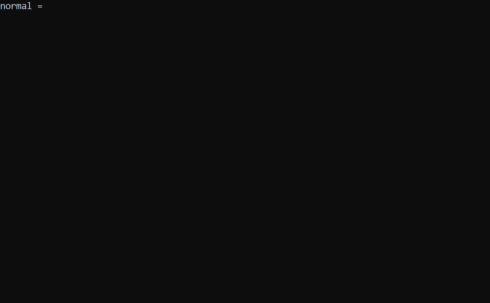

# SDBG

sdbg is a cross-platform application that can debug shaders.
It uses [SPIRV-VM](https://github.com/dfranx/SPIRV-VM). It is made only to showcase [SPIRV-VM](https://github.com/dfranx/ShaderDebugger).

## Download
Download the latest Win64 binary here: [link](https://github.com/dfranx/sdbg/releases)

## Build
To build sdbg:
```bash
git clone https://github.com/dfranx/sdbg.git
cd sdbg
git submodule update --init
cmake .
make
```

After that, you can run the shader debugger:
```bash
./bin/sdbg -f shader.hlsl --hlsl
```

## Screenshots
<p align="center">
    
</p>

## Commands
 - **step**
   - step one line
 - **get \<var_name\>**
   - get variable value
 - **jump \<line\>**
   - go to the `line`

## Arguments
 - **--file | -f \<shader\>**
   - specify input file
 - **--compiler | -c hlsl/glsl**
   - specify compiler
 - **--stage | -s \<sname\>**
   - specify shader stage (`vert` for vertex shader, `frag` for fragment shader, `geom` for geometry shader)
 - **--entry | -e \<fname\>**
   - set the entry function ("main" by default)

## Contact
If you want to contact me, send an email to this address: 
**dfranx at shadered dot org**

## LICENSE
sdbg is licensed under MIT license. See [LICENSE](./LICENSE) for more details.